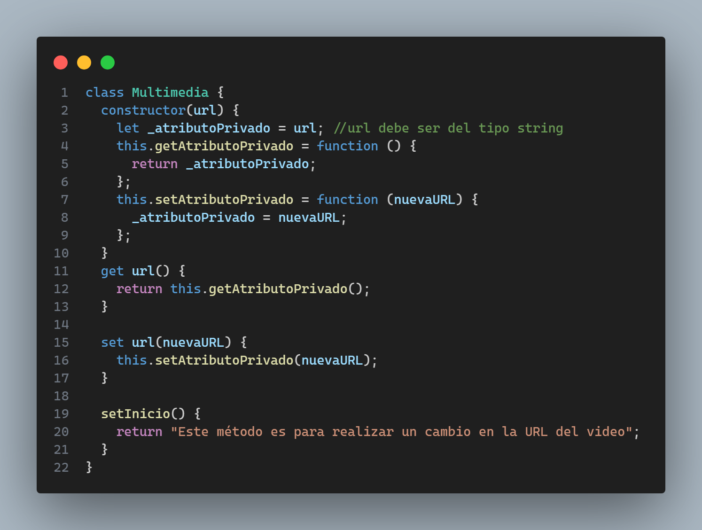
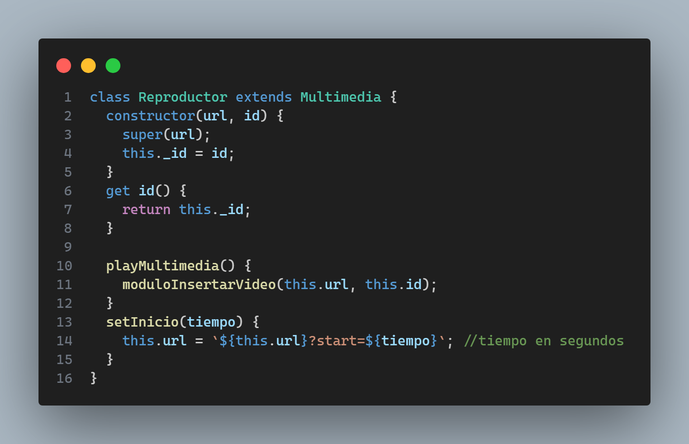
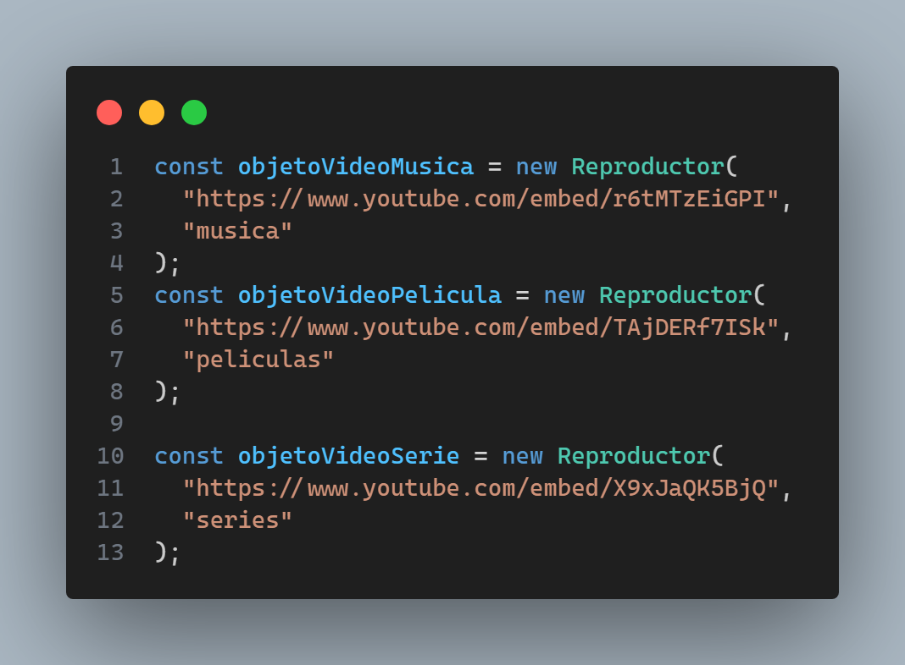
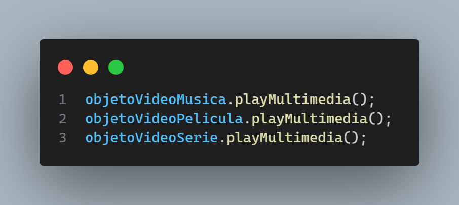

Código relacionado a **"cuarto desafío"** - **"Sugerencia de videos"** del módulo 4 **"Programación avanzada en JavaScript"** de la beca **"Desarrollo de aplicaciones Full Stack Javascript Trainee"** dictada por Desafío Latam.

<h1> REQUISITOS </h1>

### 1. Requisito (1))

#### Descripción

1-Implementar el Patrón Módulo mediante IIFE, en donde:

● Se cree una función privada que reciba la url del video y el id de la etiqueta
iframe, para así poder mostrar los videos en el documento HTML. Dato:
puedes utilizar la instrucción “setAttribute” para manipular el DOM.

● Se retorne una función pública que reciba los parámetros (url, id), y realice el
llamado a la función interna (privada) para insertar los elementos recibidos.

El patrón Módulo que he creado es el siguiente:

Como se puede observar he creado la función privada **showVideo** la cual es ejecutada dentro del retorno de la función IIFE(Immediately Invoked Function Expression). He denominado a dicha función IIFE pública como **moduloInsertarVideo**.

### 2. Requisito (2)

#### Descripción

2-Establecer una clase padre denominada Multimedia para:

● Recibir la propiedad url, ejemplo:“https://www.youtube.com/embed/5PSNL1qE6VY”, la cual será el atributo src que necesite la etiqueta iframe para poder mostrar el video.

● Proteger el atributo de la clase implementado closures

● Agregar un método denominado “setInicio”, que retorne el siguiente mensaje: “Este método es para realizar un cambio en la URL del video”.

La clase **Multimedia** la he implementando como muestro en la siguiente imagen:

● El constructor de la clase recibe la url a ser setteada como atributo de la propiedad src. Dicha url es almacenada en la variable **\_atributoPrivado** la cual es 100% privada.

● He implementado funciones que permiten realizar closures dentro del constructor de modo de acceder a la variable privada. Dichas funciones las denomino como **getAtributoPrivado** y **setAtributoPrivado**. Posteriomente, creo un getter y un setter con el nombre **url** de modo de acceder a los métodos que realizan closure sobre la variable privada. Por último, en la línea 19 creo el método **setInicio**.

### 3. Requisito (3)

#### Descripción

3-Crear una clase “Reproductor”, siendo hija de la clase padre Multimedia para:

● Recibir la propiedad id, la cual será el elemento del DOM que se necesita para poder agregar la URL en la etiqueta iframe que corresponda. Por ejemplo: Si se envía una URL para Música, el id debe ser el perteneciente a la etiqueta iframe que se encuentra en la sección de música.

● Crear un método denominado “playMultimedia”, que permita hacer el llamado a la función pública de la IIFE, enviando los atributos url y id.

● Agregar un método denominado “setInicio”, que reciba y agregue un tiempo de inicio a la URL de la etiqueta iframe. Se puede utilizar el método “setAttribute” para modificar la URL agregando al final de la misma lo siguiente: “?start=${tiempo}”. Esto permitirá que cualquiera de los videos que implemente el método inicie en el tiempo pasado como argumento al método al ser invocado.

La clase **Reproductor** la he implementando como muestro en la siguiente imagen:

● En la linea 2 creo el constructor el cual posee dos parámetros: url e id.

● En la línea 10 he creado el método **playMultimedia** el cual al ser ejecutado, también ejecuta la función IIFE pública llamada **moduloInsertarVideo**.

● En la línea 13 agrego el método **setInicio** el cual setea una nueva url pero ahora con el tiempo de inicio del video. Para lo anterior utilizo el setter de la clase Multimedia.

### 4. Requisito (4)

#### Descripción

4-Instanciar la clase hija pasando como argumento la URL y el id para cada etiqueta iframe, por lo que se deben crear tres instancias, una para música, otra para película y otra para serie, con sus respectivas URL.

### 5. Requisito (5)

#### Descripción

5-Invocar al método “playMultimedia” para cada instancia creada, mostrando así los videos en el documento HTML.

### 6. Requisito (6)

#### Descripción

6-Utiliza el método “setInicio” para modificar el tiempo de inicio en alguna de las
instancias creadas.

Como se puede observar he modificado el tiempo de inicio de los tres videos a 50 segundos para el video de música, a 30 segundos para el video de pelicula y 10 segundos para el video de series. Lo anterior se puede comprobar al hacer click en play de cada video los que comenzarán a reproducirse en los segundos establecidos anteriormente.
